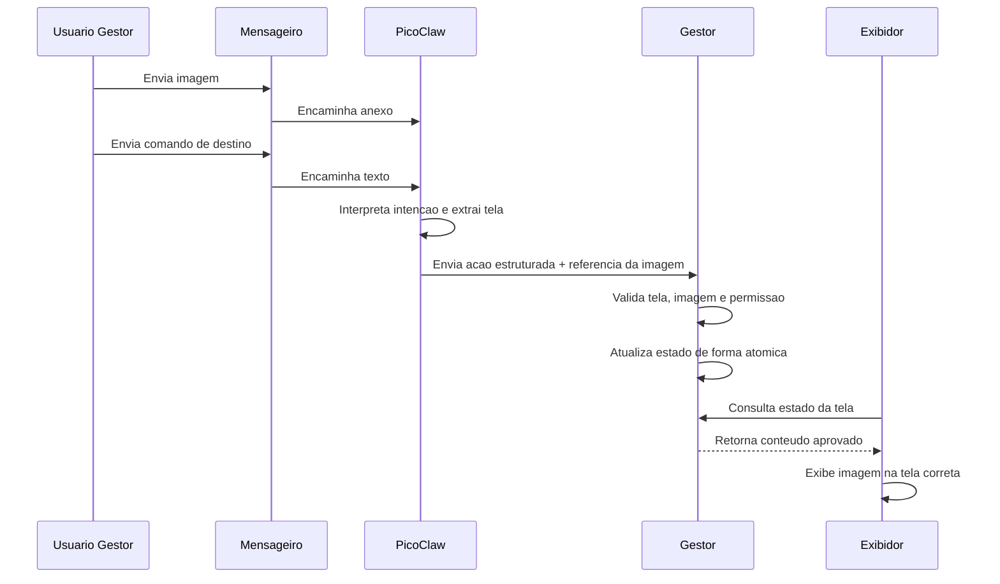

# Fluxo PicoClaw + Mensageiro + Gestor

Este documento descreve o fluxo operacional principal que a spec pretende adotar: o gestor envia uma imagem e uma instrução em um mensageiro, o PicoClaw interpreta a mensagem, valida a intenção e aciona o Gestor para publicar o conteudo na tela correta.

Este mesmo canal tambem serve para gestao de permissao: somente um usuario com papel de gestor pode autorizar, listar ou revogar outros usuarios do mensageiro, informando `chat_id`, `user_id` ou `@usuario` quando o canal suportar.

## Ideia central

O PicoClaw nao entra como uma simples camada secundaria de linguagem natural. Ele passa a ser o motor de interpretacao e orquestracao do fluxo de entrada assistida.

O mensageiro funciona como interface de captura de comando e anexo.

O Gestor continua sendo a autoridade final para validar, registrar e publicar o conteudo.

O Gestor tambem continua sendo a autoridade final para conceder ou retirar permissao de acesso ao proprio fluxo de chat.

## Fluxo de cadastro de equipamento por IP

1. O administrador cadastra uma nova TV Box no Gestor informando:
   - nome canonico da tela;
   - IP fixo;
   - token do dispositivo;
   - se o equipamento esta ativo.
2. O cadastro fica persistido em `config/dispositivos.json` e o status operacional em `state/dispositivos.json`.
3. O Exibidor instalado nessa TV envia heartbeat periodico para `POST /api/dispositivos/heartbeat` no Gestor.
4. O Gestor valida se o IP, o token e o nome da tela batem com o cadastro.
5. Se o equipamento nao responder, ou se outro dispositivo assumir aquele IP sem o token correto, o Gestor nao publica nada e devolve `TV nao encontrada/cadastrada`.
6. O comando so segue se o equipamento estiver registrado e confirmado.

## Fluxo de autorizacao de usuarios

1. O usuario gestor envia um comando de autorizacao no chat, por exemplo:
   - "autorizar @operador_tela no telegram"
   - "liberar chat_id 123456789"
   - "revogar @operador_tela"
2. O PicoClaw interpreta a intencao como uma acao administrativa.
3. O conector valida se o remetente atual e um gestor autorizado.
4. O Gestor confirma o alvo pela informacao disponivel (`chat_id`, `user_id` ou `@usuario`).
5. O Gestor atualiza a whitelist segura com:
   - estado ativo ou inativo;
   - papel do usuario;
   - quem autorizou;
   - quando foi autorizado ou revogado.
6. O sistema grava o historico de autorizacao em log proprio.
7. O gestor pode solicitar a lista de autorizados e o historico de liberacoes a qualquer momento.

## Fluxo principal

1. O usuario gestor envia uma imagem no chat.
2. O mensageiro entrega o anexo ao PicoClaw ou ao conector do sistema.
3. O sistema registra a imagem como um artefato pendente de destinacao.
4. O usuario envia uma mensagem de texto com a instrucao, por exemplo:
   - "manda isso para a tv_saguao"
   - "publica na tv_sala"
   - "essa imagem vai para a tv da diretoria"
5. O PicoClaw interpreta a mensagem e extrai:
   - acao esperada;
   - tela de destino;
   - referencia do anexo/imagem;
   - confianca ou necessidade de confirmacao.
6. O conector valida se a tela existe.
7. O conector valida se a imagem veio de um canal autenticado e se esta dentro das regras.
8. O Gestor recebe a acao estruturada final.
9. O Gestor valida novamente a acao contra a biblioteca e o estado do sistema.
10. O Gestor grava o estado de forma atomica.
11. O Exibidor correspondente consulta o Gestor e atualiza a tela.
12. O sistema registra auditoria com origem, usuario, imagem, tela e resultado.

Para comandos administrativos de autorizacao, os passos 8 a 11 mudam de acordo com a acao:

8. O Gestor recebe a acao administrativa estruturada.
9. O Gestor valida se o remetente e um gestor autorizado.
10. O Gestor atualiza whitelist e registro consultavel de autorizados.
11. O sistema registra a mudanca em log de autorizacoes e responde ao chat com o resultado.

## Fluxo resumido em diagrama

## Regras de negocio

- O mensageiro nao pode publicar conteudo diretamente.
- O PicoClaw nao pode ignorar a validacao do Gestor.
- O Gestor nunca deve confiar cegamente na saida do PicoClaw.
- A imagem precisa estar vinculada a um canal autenticado.
- Se a tela nao for identificada com confianca suficiente, o sistema deve pedir confirmacao.
- Se o anexo nao for valido, o fluxo deve ser recusado com motivo claro.
- Se o comando for administrativo, apenas um gestor autenticado pode autorizar, listar ou revogar usuarios.
- A whitelist segura e o historico de autorizados devem ser atualizados junto com cada concessao ou revogacao.
- Se o canal externo cair, o painel local continua disponivel.

## Estados possiveis

### 1. Recebido

O sistema recebeu uma imagem ou texto, mas ainda nao associou os dois.

### 2. Aguardando confirmacao

O PicoClaw entendeu a intencao, mas precisa que o usuario confirme a tela ou a acao.

### 3. Validado

O Gestor aceitou a acao e preparou a publicacao.

### 4. Publicado

O Exibidor recebeu o estado novo e passou a mostrar o conteudo.

### 5. Recusado

O sistema rejeitou a acao por falta de permissao, destino invalido, anexo invalido ou baixa confianca.

### 6. Administracao de acesso

O PicoClaw identificou um comando de autorizacao, revogacao ou consulta de usuarios, e o Gestor precisa validar a permissao do remetente antes de alterar a whitelist.

## Exemplo pratico

Mensagem 1:

> segue a arte da reuniao de pais

Mensagem 2:

> manda para a tv_saguao

Resultado esperado:

- o sistema associa a imagem enviada anteriormente;
- o PicoClaw identifica a acao como "exibir";
- o Gestor valida que "tv_saguao" existe;
- a imagem aprovada vai para a tv_saguao;
- a auditoria registra a operacao.

Exemplo administrativo:

Mensagem 1:

> autorizar @operador_tela no telegram

Resultado esperado:

- o sistema identifica a acao como administrativa;
- o remetente precisa ser um gestor autorizado;
- o Gestor grava a permissao com data, hora e autor da concessao;
- a whitelist e o registro de autorizados sao atualizados;
- a auditoria registra a mudanca.

## Fallback

Se o mensageiro estiver indisponivel, o operador usa o painel local.

Se o PicoClaw nao conseguir interpretar a instrucao, o Gestor pode solicitar confirmacao ou cair para o fluxo estruturado.

Se o comando administrativo nao trouxer `chat_id`, `user_id` ou `@usuario` suficiente, o sistema deve pedir confirmacao antes de alterar a whitelist.

Se a imagem nao puder ser validada, nada e publicado.

## O que este fluxo preserva

- Operacao local na entrega de conteudo.
- Centralidade do PicoClaw na interpretacao.
- Simplicidade para o usuario gestor.
- Controle final no Gestor.
- Auditoria e reversibilidade.
- Uma trilha clara de autorizacoes de usuarios via chat.

## Decisao que precisa ser confirmada

Antes de codificar, vale confirmar se o comportamento correto e:

- o usuario manda a imagem e depois manda a instrucao em uma segunda mensagem;
- ou o usuario manda imagem + legenda no mesmo envio, e o PicoClaw tenta extrair destino da mesma conversa.

Este documento assume o primeiro modelo como mais claro e confiavel para o MVP.